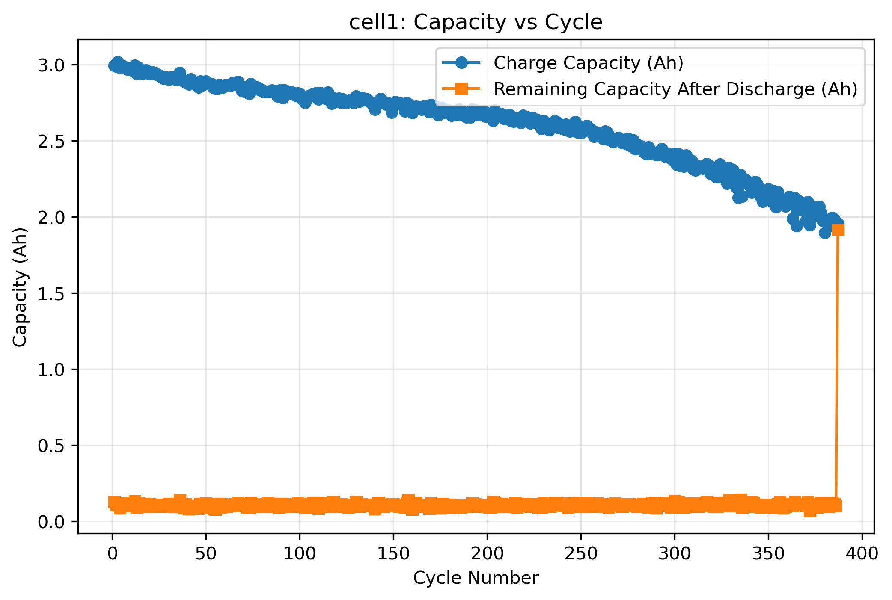
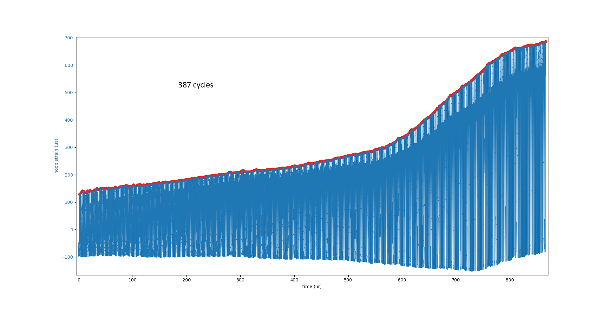

# Source Data
Original source data prior to any preprocessing. Files, _1__ChargeCycle1 and _3__ChargeCycle1, were split into 2 parts due to file size. The file parts must be must combined and named as previously stated for scripts to work. Below are explainations of the scripts and instructions for usage. Calculated cycle capacities for each cell are located in the Capacity folder.

## 📊 Data Columns
- Time
Timestamp of each measurement, recorded in seconds.
- Current
Cell current measured in amperes (A).
- Voltage
Cell voltage measured in volts (V).
- Cell Temperature
Surface temperature of the cell in degrees Celsius (°C).
- Hoop Strain
Mechanical hoop strain on the battery casing, measured in strain (ε).

## 🔋 Capacity_Extractor
A lightweight, cycle‑aware capacity analysis tool for battery test data.
This script processes charge/discharge .lvm files, detects cycle boundaries, computes per‑cycle capacities, exports clean summary files for each cell, and generates a capacity-vs-cycle plot for each cell.

### 📘 Overview
The Capacity_Extractor script computes per‑cycle charge and discharge capacities for multiple battery cells. It is designed for datasets where:
- Each cell has separate charge and discharge files
- Cycles are embedded within each file
- Time resets or large time gaps indicate new cycles
- The initial SOC is unknown, so each cell receives its own QSTART offset

The script ensures:
- QSTART applies only to cycle 1 (per cell)
- Every other cycle starts from zero
- Discharge capacity continues from the charge capacity of the same cycle
- No cross‑cycle carry‑over
- Capacity fade emerges naturally as integrals shrink with age
All results are written to a dedicated Capacity/ folder.

### ⚙️ How the Script Works
#### 1. Load charge and discharge data
```text
For each cell, the script loads:
Charge file:    *_ChargeCycle*.lvm
Discharge file: *_DischargeCycle*.lvm
```

You define these in the cells dictionary.

#### 2. Detect cycles automatically
Cycles are identified by:
- Timestamp resets
- Large time gaps (configurable threshold)
Each cycle is processed independently.

#### 3. Compute charge capacity
- Cycle 1 uses the cell’s QSTART offset:
```text
Qc1 = QSTART + ∫ I_charge dt
```
- Cycles 2 and higher start from 0.1 offset:
```text
Qc(n>=2) = Q + ∫ I_charge dt
```
#### 4. Compute discharge Capacity
Discharge always begins from the charge capacity of the same cycle:
```text
Qd(n) = Qc(n) - ∫ |I_discharge| dt
```
#### 5. Export results
For each cell, the script writes:
```text
Capacity/cellX_capacity_summary.lvm
```
#### 6. View the generated plot
Each plot shows:
```text
- Capacity vs. cycle
- A title indicating the cell
- Dual y‑axes (charge capacity and remaining capacity after discharge)

This helps visualize cell capacity fade.
```
### ▶️ How to Use the Script
#### 1. Add your data files
Place your .lvm charge/discharge files in the same directory as the script.
Update the cells dictionary:
```text
cells = {
    "cell1": ["_1__ChargeCycle1.lvm","_1__DischargeCycle1.lvm"],
    "cell2": ["_2__ChargeCycle1.lvm","_2__DischargeCycle1.lvm"],
    "cell3": ["_3__ChargeCycle1.lvm","_3__DischargeCycle1.lvm"]
}
```


#### 2. Set QSTART for each cell
QSTART is applied only to cycle 1:
```text
QSTARTS = {
    "cell1": 1.50,
    "cell2": 1.40,
    "cell3": 1.60
}
```


#### 3. Run the script
It will:
- Detect cycles
- Compute charge/discharge capacities
- Save summary files in Capacity/
- No user interaction required.

#### 4. View the output
Example:
```text
Cycle	ChargeCapacity_Ah	RemainingCapacity_after_Discharge_Ah
1	    4.32		        0.22
2	    2.79		        0.25
3	    2.75		        0.28
```


### 🧭 Processing Flow
```text
          ┌──────────────────────────┐
          │     Start the script     │
          └──────────┬───────────────┘
                     │
                     ▼
      ┌────────────────────────────────┐
      │ Load charge & discharge files  │
      └──────────┬─────────────────────┘
                 │
                 ▼
   ┌──────────────────────────────────────┐
   │ Detect cycles from timestamp jumps   │
   └──────────┬───────────────────────────┘
              │
              ▼
   ┌──────────────────────────────────────┐
   │ Compute charge capacity per cycle    │
   │ (QSTART added only to cycle 1)       │
   └──────────┬───────────────────────────┘
              │
              ▼
   ┌──────────────────────────────────────┐
   │ Compute discharge capacity per cycle │
   │ (starts from charge capacity)        │
   └──────────┬───────────────────────────┘
              │
              ▼
   ┌──────────────────────────────────────┐
   │ Save summary file in SOC/ folder     │
   └──────────┬───────────────────────────┘
              │
              ▼
   ┌─────────────────────────────┐
   │ Plot capacity vs. cycle     │
   └─────────────────────────────┘   
```

### 📂 Output Directory Structure
```text
project/
├── Capacity_Extractor.py
├── _1__ChargeCycle1.lvm
├── _1__DischargeCycle1.lvm
├── _2__ChargeCycle1.lvm
├── _2__DischargeCycle1.lvm
│
└── Capacity/
    ├── cell1_capacity_summary.lvm
    ├── cell2_capacity_summary.lvm
    └── cell3_capacity_summary.lvm
```
### 📄 Example Output


## 📘 Cell_Combined_Cycle_Plot Script
This script loads charge and discharge .lvm files for each battery cell, aligns their timestamps, merges them into a single continuous dataset, removes invalid strain spikes, detects strain‑based cycling events, and generates a strain‑vs‑time plot with peak markers.

### 🔍 What the Script Does
For each cell, the script:
```text
- Loads the charge and discharge files
- Drops rows with missing current or voltage
- Converts time from seconds to hours
- Converts strain to microstrain
- Computes milliamp‑hours using the trapezoidal rule
- Detects the timestamp jump between charge and discharge
- Shifts the discharge timestamps so both datasets align
- Merges charge and discharge into a single .lvm file
- Removes strain outliers (for cell3 only)
- Detects strain peaks to estimate the number of cycles
- Plots strain vs. time and highlights the detected peaks

This produces a clean, continuous dataset and a visual representation of strain cycling behavior.
```
### ▶️ How to Use the Script
#### 1. Place your data files
Each cell must have:
```text
Charge file:    *_ChargeCycle1.lvm
Discharge file: *_DischargeCycle1.lvm

The script automatically loads them based on the cells dictionary.
```
#### 2. Run the script
The script will:
```text
- Load and clean the charge and discharge data
- Align the discharge timestamps to follow the charge data
- Merge both into a single continuous .lvm file
- Detect strain peaks
- Count the number of cycles
- Generate a strain plot with peak markers
```
#### 3. View the merged output
For each cell, the script writes:
```text
cell1.lvm
cell2.lvm
cell3.lvm

These contain the combined charge+discharge dataset sorted by time.
```
#### 4. Inspect the cycle count
The script prints:
```text
Number of cycles: X

This is based on the number of positive strain peaks detected.
```
#### 5. View the generated plot
Each plot shows:
```text
- Strain vs. time
- Red markers at detected peaks
- A title indicating the cell
- Dual y‑axes (strain and max strain)

This helps visualize mechanical cycling behavior.
```
### 🧭 Processing Diagram
```text
          ┌──────────────────────────┐
          │     Start the script     │
          └──────────┬───────────────┘
                     │
                     ▼
      ┌────────────────────────────────┐
      │ Load charge & discharge files  │
      └──────────┬─────────────────────┘
                 │
                 ▼
   ┌──────────────────────────────────────┐
   │ Clean data (drop NaNs, convert units)│
   └──────────┬───────────────────────────┘
              │
              ▼
   ┌──────────────────────────────────────┐
   │ Detect timestamp jump between files  │
   │ Shift discharge timestamps           │
   └──────────┬───────────────────────────┘
              │
              ▼
   ┌───────────────────────────────────────┐
   │ Merge charge + discharge into one file│
   └──────────┬────────────────────────────┘
              │
              ▼
   ┌──────────────────────────────────────┐
   │ Remove strain outliers (cell3 only)  │
   └──────────┬───────────────────────────┘
              │
              ▼
   ┌──────────────────────────────────────┐
   │ Detect strain peaks and count cycles │
   └──────────┬───────────────────────────┘
              │
              ▼
   ┌──────────────────────────────────────┐
   │ Plot strain vs. time with peaks      │
   └──────────────────────────────────────┘
```

### 🔢 Explanation of Key Computations
```text
Timestamp Alignment
The script finds the first large jump in the charge file’s time column.
This jump marks the end of charge and the start of discharge.
The discharge timestamps are shifted forward by this amount so both datasets form a continuous timeline.
Milliamp‑Hour Calculation
The script uses the trapezoidal rule:
mAh = cumulative sum of (average current * time difference * 1000)

This produces a smooth estimate of charge throughput.
Strain Peak Detection
The script identifies peaks in the strain signal using:
- Minimum distance between peaks
- Minimum prominence
- Positive strain only
The number of detected peaks corresponds to the number of mechanical cycles.
```
### 📄 Example Output
Number of cycles: 147

A plot is displayed showing strain vs. time with red peak markers.



## 📘 3_Cell_Dataset_Splicer Script
This script takes raw charge and discharge .lvm files for each battery cell and automatically splits them into individual cycle files. It uses timestamp jumps to detect where each cycle begins and ends, aligns discharge timestamps so they follow the charge data, flips the strain sign for consistency, and saves each cycle into organized folders.

### 🔍 What the Script Does
For each cell, the script:
```text
- Loads the charge and discharge .lvm files
- Drops rows with missing current or voltage
- Detects cycle boundaries based on large jumps in the time column
- Aligns discharge timestamps so charge and discharge form a continuous timeline
- Flips the strain column sign for both datasets
- Splits the data into cycle‑by‑cycle segments
- Saves each cycle into separate charge/ and discharge/ folders
This produces a clean, structured dataset where each cycle is isolated and ready for downstream analysis.
```
### ▶️ How to Use the Script
#### 1. Place your data files
Each cell must have:

```text
Charge file:    *_ChargeCycle1.lvm
Discharge file: *_DischargeCycle1.lvm
```

The script automatically loads them based on the cells dictionary.

#### 2. Run the script
The script will:
```text
- Load the charge and discharge files
- Detect cycle boundaries
- Align timestamps
- Flip strain values
- Split the data into cycles
- Save each cycle into:
cell1/charge/charge_1_1.lvm
cell1/discharge/discharge_1_1.lvm
cell1/charge/charge_1_2.lvm
cell1/discharge/discharge_1_2.lvm

Each pair corresponds to one cycle.
```
#### 3. Inspect the output folders
For each cell, the script creates:
```text
cell1/
   ├── charge/
   │     ├── charge_1_1.lvm
   │     ├── charge_1_2.lvm
   │     └── ...
   └── discharge/
         ├── discharge_1_1.lvm
         ├── discharge_1_2.lvm
         └── ...


This structure keeps cycles cleanly separated and easy to process.
```
### 🧭 Processing Diagram
```text
          ┌──────────────────────────┐
          │     Start the script     │
          └──────────┬───────────────┘
                     │
                     ▼
      ┌────────────────────────────────┐
      │ Load charge & discharge files  │
      └──────────┬─────────────────────┘
                 │
                 ▼
   ┌──────────────────────────────────────┐
   │ Drop NaNs and clean data             │
   └──────────┬───────────────────────────┘
              │
              ▼
   ┌──────────────────────────────────────┐
   │ Detect cycle boundaries from jumps   │
   │ in the time column                   │
   └──────────┬───────────────────────────┘
              │
              ▼
   ┌──────────────────────────────────────┐
   │ Shift discharge timestamps to follow │
   │ the charge data                      │
   └──────────┬───────────────────────────┘
              │
              ▼
   ┌──────────────────────────────────────┐
   │ Flip strain sign for consistency     │
   └──────────┬───────────────────────────┘
              │
              ▼
   ┌──────────────────────────────────────┐
   │ Split charge & discharge into cycles │
   └──────────┬───────────────────────────┘
              │
              ▼
   ┌──────────────────────────────────────┐
   │ Save cycle files into charge/        │
   │ and discharge/ folders               │
   └──────────────────────────────────────┘
```

### 🔢 Explanation of Key Steps
```text
Cycle Boundary Detection
The script looks for large jumps in the time column.
A jump indicates the start of a new cycle.

Example:
If time difference > 100 seconds → new cycle

Timestamp Alignment
The discharge file starts at time zero, so the script shifts it forward so it follows the charge file seamlessly.
Strain Sign Correction
Both charge and discharge strain columns are multiplied by -1 to ensure consistent sign convention.

Cycle Splitting
For each detected cycle:
- A slice of the charge data is saved
- A slice of the discharge data is saved
- Filenames include both the cell index and cycle number
```
### 📄 Example Output
```text
cell2/
   charge/
      charge_2_1.lvm
      charge_2_2.lvm
      charge_2_3.lvm
   discharge/
      discharge_2_1.lvm
      discharge_2_2.lvm
      discharge_2_3.lvm


Each pair corresponds to one complete cycle.
```
