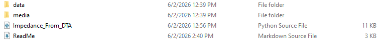

Test Run: Potentiostatic EIS
Test Date: (Enter Date)

How to use:
 1) Open Impedance_From_DTA
 2) Change the folder path
     - The data folder should be a subdirectory of updated folder path
     - File should like the image below
        
 3) If needed change the cell count
     - Default cell count is 3
     - Will break the Display_Graph.md
     - Will need to add or remove colors as desired
 4) Run the code.

This is an impedance test using a Gamry Reference 3000.

R-V Data was collected using the BK Analyzer BA6010

Test Settings
 - DC Voltage (V): 0 vs. EOC
 - AC Voltage (mV rms): 10
 - Initial Freq (Hz): 10000
 - Final Freq (Hz): .01
 - Points/decade: 10
 - Area (cm^2): 2.54
 - Conditioning: Off
 - Init. Delay: 600s
 - Drift Correction: On
 - THD: Off
 - Estimated Z (Ohms): .1
 - Open Circuit (V): 

 - Test Notes: (Copy and Paste if needed)
    - Potentiostatic EIS Data Test performed on (Cell Type) battery.
    - 10 AC mV rms performed on 3/30/26
    - Battery # (Cell Type)
    - Tested Samsung (Cell Type) battery
    - Custom Battery Holder Tray. Wood Base w/ reference alligator clips connected to the center of the banana plug.
    - No Floating Ground
    - No Faraday Cage

Cells Tested:
 1) Cell 1: 
 
    
    
    
 2) Cell 2: 

      
    
      
 3) Cell 3:
 
      
    
      
 4) Overlay of all 3 Cells:
 
      
    
      